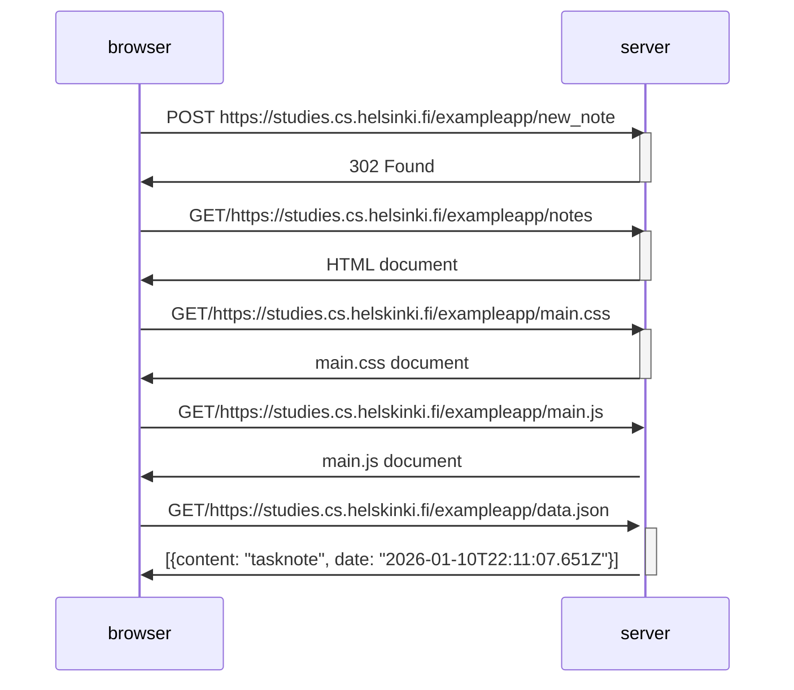

```mermaid

sequenceDiagram
        participant browser
        participant server

        %% Sending a POST request that returns 302 Found (A redirect to /exampleapp/notes)
        browser->>server: POST https://studies.cs.helsinki.fi/exampleapp/new_note
        activate server
        server->>browser: 302 Found
        deactivate server


        %% The redirect guides browser to a GET request for an HTML file @ /exampleapp/notes
        browser->>server: GET/https://studies.cs.helsinki.fi/exampleapp/notes
        activate server
        server->>browser: HTML document
        deactivate server

        %% The redirect guides browser to a GET request for a css file @ /exampleapp/main.css
        browser->>server: GET/https://studies.cs.helskinki.fi/exampleapp/main.css
        activate server
        server->>browser: main.css document
        deactivate server

        %% The redirect guides browser to the last GET request, a JS file @ /exampleapp/main.js
        browser->>server: GET/https://studies.cs.helskinki.fi/exampleapp/main.js
        activate server
        server->>browser: main.js document

        %% The JS file calls for the JSON file with "JSON.parse(this.responseText)
        browser->>server: GET/https://studies.cs.helskinki.fi/exampleapp/data.json
        activate server
        server->>browser: [{content: "tasknote", date: "2026-01-10T22:11:07.651Z"}]
        deactivate server


```
